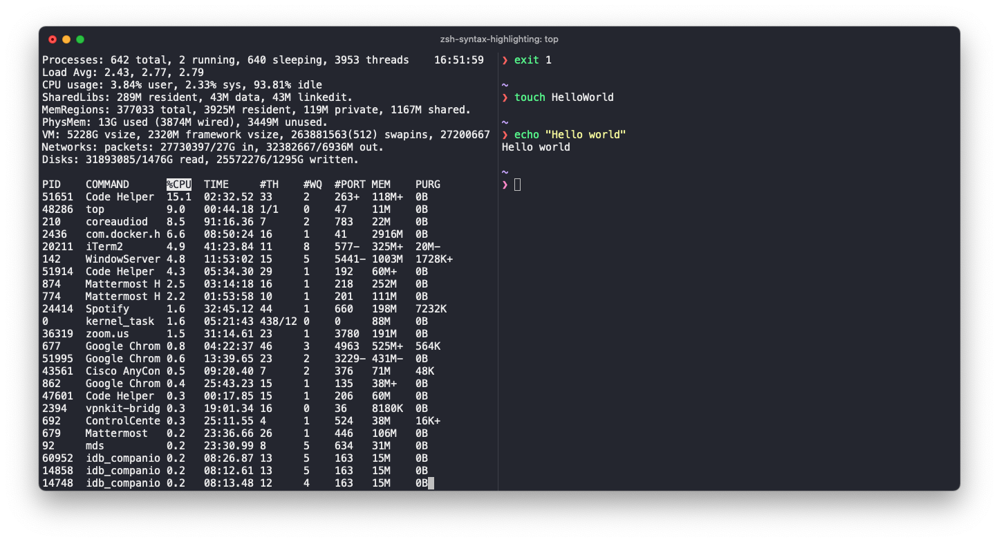

# Configuration for iterm2 OR zsh


## ZSH
### Firstly, `brew`
```bash
$ /bin/bash -c "$(curl -fsSL https://raw.githubusercontent.com/Homebrew/install/HEAD/install.sh)"
```

Add this to `~/.bashrc` file

```bash
$ export PATH="/usr/local/bin:$PATH"
```

```bash
$ brew install zsh
```

After you done this, please copy `.zshrc` in this repo and replace it. <br />

*Note*: Please remember to change the below line to the correct path on your file system. Its located at the top line of `.zshrc` file
```bash
export ZSH="/Users/tu.nguyendich/.oh-my-zsh
``` 
Run below command to install `pure` and other awesome plugins
```bash
$ git clone https://github.com/sindresorhus/pure.git "$HOME/.zsh/pure" &&
   git clone https://github.com/zsh-users/zsh-autosuggestions ${ZSH_CUSTOM:-~/.oh-my-zsh/custom}/plugins/zsh-autosuggestions &&
   git clone https://github.com/zsh-users/zsh-syntax-highlighting.git ${ZSH_CUSTOM:-~/.oh-my-zsh/custom}/plugins/zsh-syntax-highlighting 
```

Last step, activate your profile
```bash
$ source ~/.zshrc
```

## Iterm2
Preloaded Dracula theme and Menlo font is configured in this `iterm2/andy_iterm2.json` file, just import it to your Iterm2 and it should be good to go. If Menlo is not avalable, please switch back to `Monaco` instead.

```bash
❤️ Thanks ❤️
```


